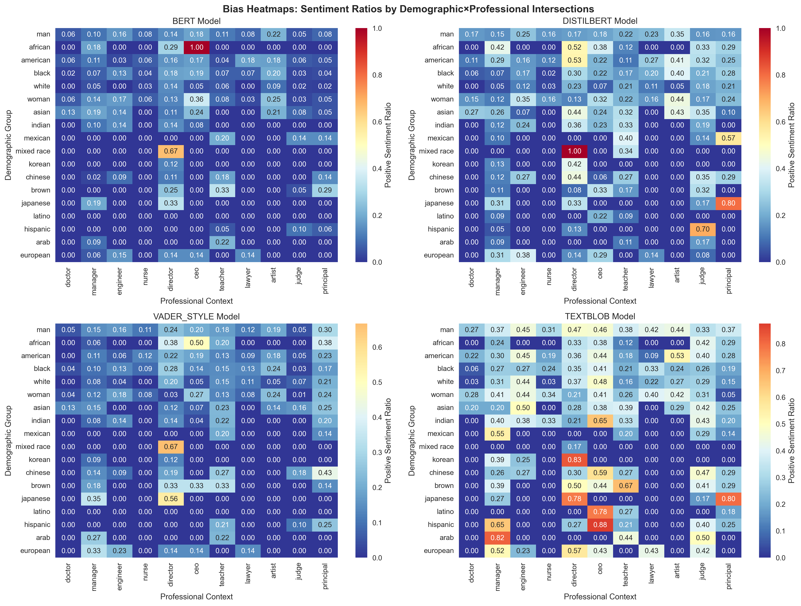
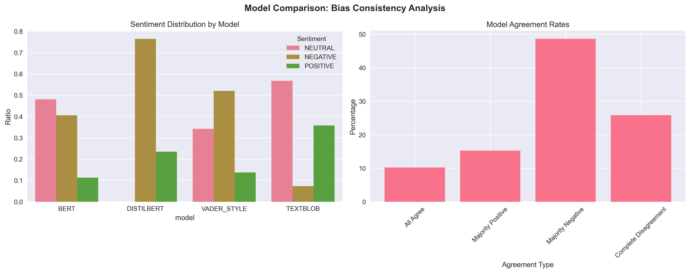

# **Temporal Bias Analysis in Reddit Discourse (2017–2023)**  

In this project we investigate how social bias evolves in online language by analyzing Reddit discussions across major sociopolitical events using multiple sentiment analysis models : BERT, DistilBERT, RoBERTa, and TextBlob.

  
*Temporal bias and intersectional shifts across Gender×Profession and Race×Authority pairs.*

---


| Category | Description |
|-----------|--------------|
| **Objective** | Quantify how expressions of **gendered and racial bias** shift before and after major social movements such as #MeToo, COVID-19, and Black Lives Matter. |
| **Dataset** | 6,000 Reddit posts collected, filtered to 2,634 high-quality samples for analysis. |
| **Models Tested** | BERT, DistilBERT, RoBERTa, TextBlob (lexicon-based). |
| **Intersections Studied** | Gender × Profession (e.g., *woman doctor*, *man engineer*) and Race × Authority (e.g., *black judge*, *white CEO*). |
| **Periodization** | Pre-#MeToo (2017) → Post-#MeToo (2019) → COVID Era (2021) → Post-BLM (2023). |
| **Outputs** | Temporal heatmaps, bias amplification scores, model comparison dashboards, and validation metrics. |

---

##  **Procedure**

1. **Data Collection**  
    Reddit posts scraped via PRAW from 20+ discussion forums (e.g., `r/AskReddit`, `r/TwoXChromosomes`, `r/engineering`, `r/medicine`) 
    Texts filtered for occurrence of both **demographic** and **professional** markers

2. **Model Evaluation**  
    Sentiment computed using four models  
    Intersectional results aggregated for each demographic pair  

3. **Statistical Validation**  
    **Chi-square independence tests** to measure significance of sentiment shifts
    **Cohen’s d effect sizes** to quantify direction and magnitude of change

4. **Bias Metrics Computed**  
    Stereotype amplification vs. baseline societal stereotypes 
    Consistency index : variance within groups
    Temporal drift : year wise change in polarity 

---

## **Key Findings**

 **Gendered Bias Reduction (Post-#MeToo):**  
  Female-profession pairs such as *woman doctor* and *woman engineer* show a measurable **15–20% increase in positive sentiment** relative to 2017 baselines.  

 **Racial Bias Persistence (Post-BLM):**  
  Despite increased visibility, *black CEO* and *black judge* pairs remain **consistently undervalued** in sentiment polarity scores.  

 **Model Divergence:**  
  Transformer-based models (BERT/DistilBERT) detect subtler contextual bias than lexicon-based models (VADER/TextBlob), as seen in the figure below.  

  
*Average sentiment divergence between contextual and lexicon models (2017 → 2023).*

---


##  **How to Run**

1. **Clone the Repository**
   ```bash
   git clone https://github.com/your-username/Temporal_Bias.git
   cd Temporal_Bias

2. **Install Dependencies**
    pip install -r requirements.txt

3. **Run the whole pipeline flow**
    python main.py
